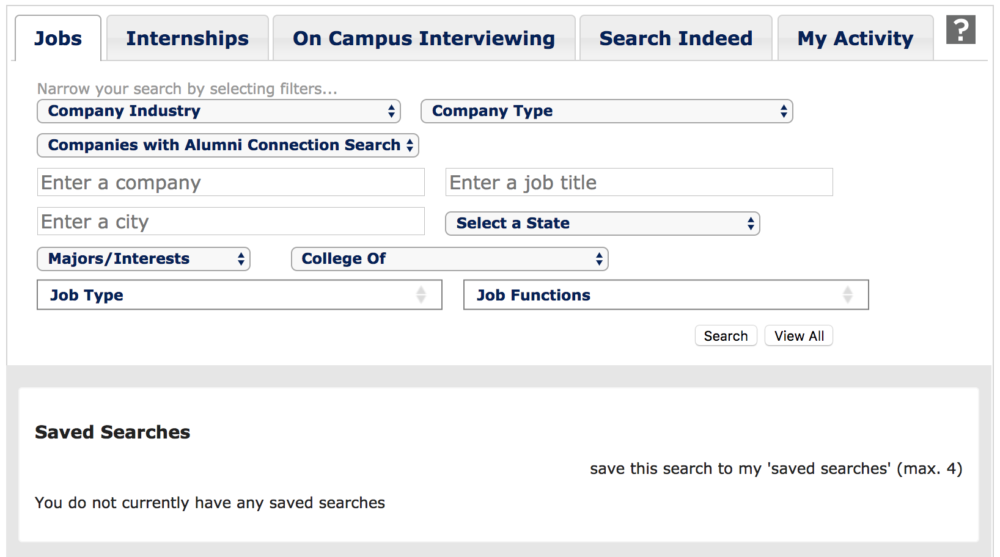
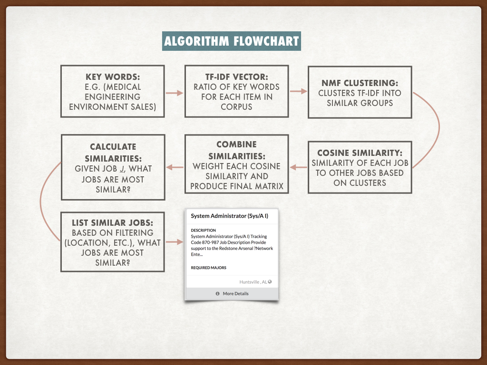
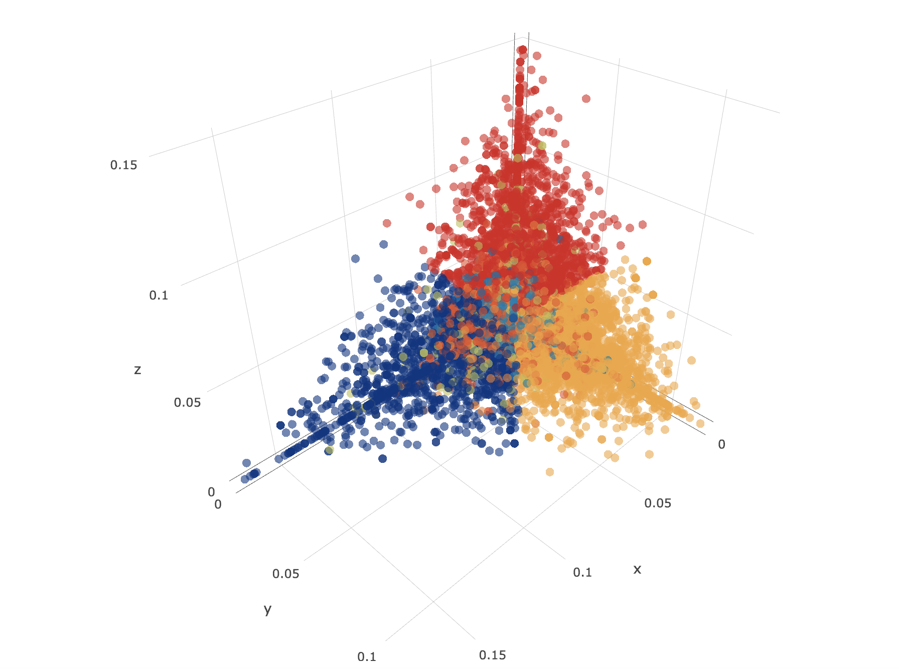
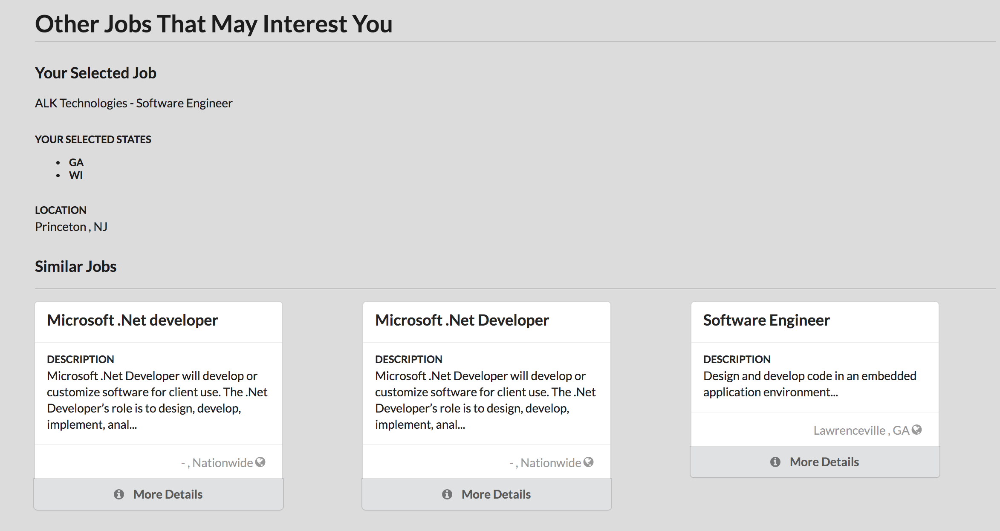
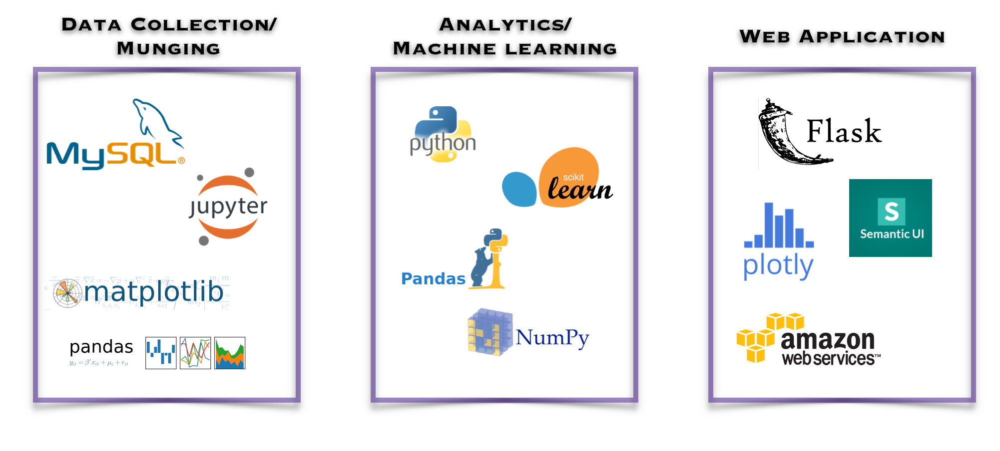

## Spotifying College Career Services

**Dan Edstrom** 

 **Galvanize Data Science Immersive Fellow** 

**October, 2017**

## Table of Contents
1. [Background](#background)
2. [Project Hypothesis](#project-hypothesis)
3. [Special Considerations](#special-considerations)
4. [Data](#data)
5. [Methods](#methods)
6. [Process Workflow](#process-workflow-diagram)
7. [Analytics Workflow](#analytics-workflow-diagram)
8. [Results](#results)
9. [Future Work](#future-work)
10. [Technology Stack](#technology-stack)
11. [References](#references)
12. [Acknowledgements](#acknowledgements)

### Background

As students near the end of their college experience, a rite of passage is working with career services to prepare for that first big post-college job.  In the past, the career services experience has been frought with challenges and students may be left navigating an employment search that is poorly defined and fails to provide meaningful career prospects.  

In order to create a better experience for students, and to create a common and standardized platform for colleges, several companies have emerged that provide career services platforms to serve the needs of career services.  One such company is [Purple Briefcase](http://www.purplebriefcase.com/).  Their platform allows students to fill out a profile, explore available jobs, and apply directly through the platform.  Employers have the ability to post jobs that can then get sent out to multiple colleges and universities, making the process simpler for company recruiters while expanding the availability of top candidates. [Top](#table-of-contents)

### Project Hypothesis

Career services, including those provided by [Purple Briefcase](http://www.purplebriefcase.com/) allow for general job searches based on generic location and key words.  Can the career services search engine be improved by pushing recommended jobs to students based on jobs in which they have expressed interest?

#### The current Jobs Search Page

### Special Considerations

Recommender engines exist everywhere these days.  Any scenario that has a set of users and a set of items that can be made available to those users can potentially utilize a recommender engine.  However, career services has a set of use cases and constraints that are different than other recommender use cases:

+ Feedback on quality of jobs presented is implicit.  In other words, students do not rate the jobs presented, but we can use success metrics such as 'saved' or 'applied' in order to define the ranks.

+ Jobs that can be recommended to a user have specific time constraints.  While a movie can be recommended months or years after it was first produced, jobs have a short window upon which students can apply.  In addition, jobs that have just recently been posted are of greater interest than jobs that have been posted for several weeks.

+ It may only be appropriate to recommend the same job to a limited number of users so as not to bombard the recruiter with an unwieldy number of applicants.

+ Students can set up a profile listing their top choice of city, state and industry.  These may not represent equal weighting amongst students.  In other words, a student could list a specific city as their preference even though they are open to other geographic locations.

### Data

The data used to create the recommender come from employers who utilize the Purple Briefcase platform.  The data represent a variety of job types, including part-time on-campus jobs, internships, volunteer opportunitites, as well as full-time post-collegiate positions.  For the purposes of this project, the following posted job-types were included in the dataset:

+ Full-Time (excluding volunteer)
+ Fellowship
+ Research
+ Direct Hire
+ Temp to Hire
+ Freelance
+ Apprenticeship
+ Practicum

This resulted in ~ 29,000 jobs.  Of this original set, there were 5,395 applications.  This created a matrix that was > 99.9% sparse.  As such, traditional recommender methods would not suffice.

### Methods

A variety of free form text information is available for each posted job. Rather than use matrix factorization techniques on a sparse implicit feedback matrix, I chose to use Natural Language Processing on several text fields in order to recommended jobs based on their similarity of text entries, including:

1. Submitted job descriptions
2. Submitted job titles
4. Job categories that are created for each job.

Using this approach, I could also avoid the cold-start problem that arises when users have not yet provided feedback on items.  In this solution, a user can select a job of interest.  The algorithm can then propose similar jobs based on the above methods.

### Process Workflow Diagram

### Analytics Workflow Diagram

### Results

After performing TF-IDF vectorization, I used non-negative matrix factorization (NMF) to cluster the data into relevant groups. Below is a plot of the three largest cluster differences for job **descriptions** from the NMF clustering:

##### Sample recommended search results

### Future Work

Information beyond applications is available, including:

1. Whether or not someone viewed a job.
2. Whether or not someone marked a job as a favorite.
3. The number of times someone viewed a job.

A new version of the recommender engine could be developed using an implicit feedback scorecard system.  This may provide more relevant results.

In addition, understanding the differences between job categories and creating tailored recommender engines for each category may be of value.

### Technology Stack

### References
1. [Apan, Preetha. 2016. Algorithms and Architecture for Job Recommendations. O'Reilly Press. https://www.oreilly.com/ideas/algorithms-and-architecture-for-job-recommendations](https://www.oreilly.com/ideas/algorithms-and-architecture-for-job-recommendations)
2. [Lescovek, Jule, Rajaraman, Anand, and Ullman, Jeffrey D. 2014. Mining of Massive Datasets, chapter 9](http://infolab.stanford.edu/~ullman/mmds/ch9.pdf)
3. Harrington, Peter. 2012. Machine Learning in Action, chapter 14
4. [Yeung, Albert Au. 2010. Matrix Factorization: A Simple Tutorial and Implementation in Python [blog post]. Retrieved from Matrix Factorization: A Simple Tutorial and Implementation in Python](http://www.quuxlabs.com/blog/2010/09/matrix-factorization-a-simple-tutorial-and-implementation-in-python/)

### Acknowledgements

+ Galvanize instructors, residents and fellow DSI students, who have been an endless source of knowlege and guidance during this program.
+ Brian and Allie Keenan at Purple Briefcase, who gave me access to their data and provided expertise and guidance throughout the project.
+ Ruffalo Noel Levitz senior leadership, for allowing me the opportunity to take part in this immersive program.
+ Brian Kasen, for help with all things HTML and JavaScript.
+ My wife Sarah, daughter Nell, and son Emery, for patience, support and endless understanding of what it is like to chase after something challenging and exciting.

 