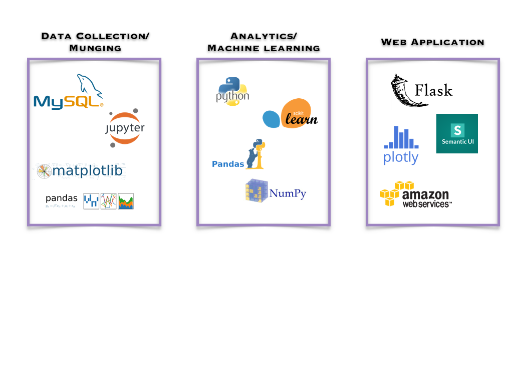

## Spotifying College Career Services

As students near the end of their college experience, a rite of passage is working with career services to prepare for that first big post-college job.  In the past, the career services experience has been frought with challenges and students may be left navigating an employment search that is poorly defined and fails to provide meaningful career prospects.  

In order to create a better experience for students, and to create a common and standardized platform for colleges, several companies have emerged that provide career services platforms to serve the needs of career services.  One such company is [Purple Briefcase](http://www.purplebriefcase.com/).  Their platform allows students to fill out a profile, explore available jobs, and apply directly through the platform.  Employers have the ability to post jobs that can then get sent out to multiple colleges and universities, making the process simpler for company recruiters while expanding the availability of top candidates.

### How Recommender Engines can improve career services.

Recommender engines exist everywhere these days.  Any scenario that has a set of users and a set of items that can be made available to those users can potentially utilize a recommender engine.  However, career services has a set of use cases and constraints that are different than other recommender use cases:

+ Feedback on quality of jobs presented is implicit.  In other words, students do not rate the jobs presented, but we use success metrics such as 'saved' or 'applied' in order to define the ranks.

+ Jobs that can be recommended to a user have specific time constraints.  While a movie can be recommended months or years after it was first produced, jobs have a short window upon which students can apply.  In addition, jobs that have just recently been posted are of greater interest than jobs that have been posted for several weeks.

+ It may only be appropriate to recommend the same job to a limited number of users so as not to bombard the recruiter with an unwieldy number of applicants.

+ Students can set up a profile listing their top choice of city, state and industry.  These may not represent equal weighting amongst students.  In other words, a student could list a specific city as their preference even though they are open to other geographic locations.

### Data.

The data used to create the recommender come from employers who utilize the Purple Briefcase platform.  The data represent a variety of job types, including part-time on-campus jobs, internships, volunteer opportunitites, as well as full-time post-collegiate positions.  For the purposes of this project, the following posted job-types were included in the dataset:

+ Full-Time (excluding volunteer)
+ Fellowship
+ Research
+ Direct Hire
+ Temp to Hire
+ Freelance
+ Apprenticeship
+ Practicum

This resulted in 63,276 jobs.  Of this original set, there were 5,395 unique applications.  This created a matrix that was 99.63% sparse.
 
### Methods

### Plots
1. Run logistic regression on factors that predict whether someone will apply for a job
2. Bar charts of in-state, in-city applications
3. Map of locations where posted jobs exist. (??)

### Results

### Future Work

### Tools

### References
[Apan, Preetha. 2016. Algorithms and Architecture for Job Recommendations. O'Reilly Press. https://www.oreilly.com/ideas/algorithms-and-architecture-for-job-recommendations](https://www.oreilly.com/ideas/algorithms-and-architecture-for-job-recommendations)

 